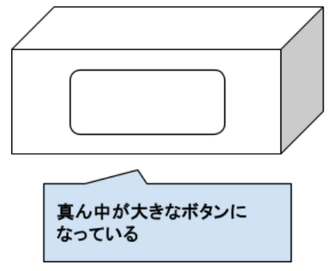
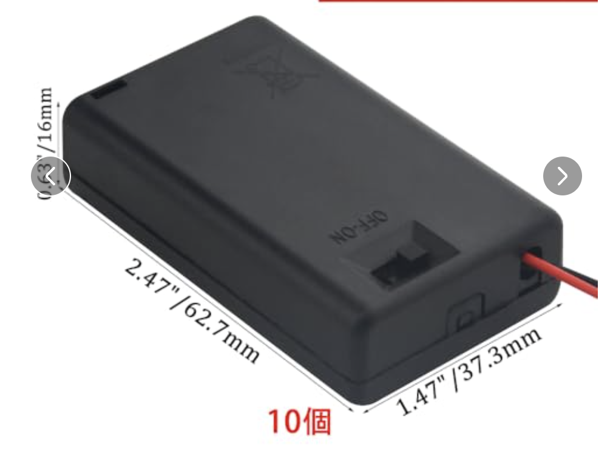
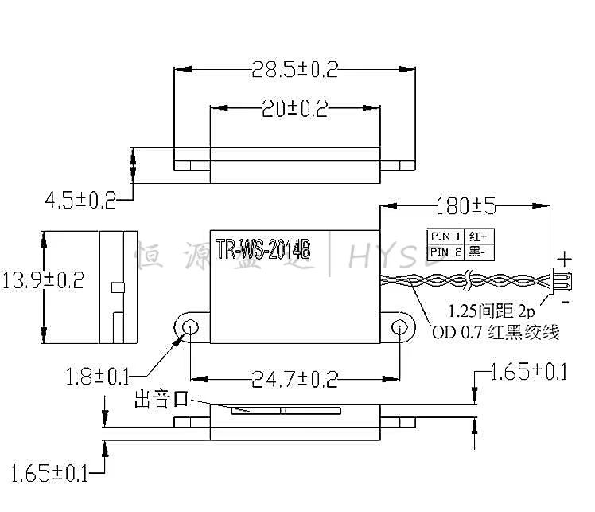

# オーディオストリーミングスタンド開発ボード ver.2 ケース（外装）データ
XIAO ESP32C3 に TFカード, RTC, オーディオアンプなどを追加したオーディオストリーミングボード ケースのデータ

本ケースの3Dモデルデータは **OpenSCAD**（`.scad`）を用いてパラメータ設計・作成します。

## ケース イメージ図
  
- 上下2分割（トップカバー / ボトムケース）構造の正方形ケース
- トップカバーの手前側面（フロント）に大型プッシュボタンを配置
- ボトムケース内部底面にスピーカー固定用ネジ穴を配置

## 主な部品

### 1. オーディオストリーミングスタンド開発ボード ver.2 基板
- **基板寸法**: 60mm × 60mm
- **角丸**: R = 2.0mm
- **取付穴**: 四隅 52mm × 52mm 位置に M2 ネジ穴
- **基板搭載部品**: XIAO ESP32C3, 横向きタクトスイッチ(EVQPUC02K), オンボードLED(WS2812B), 音量調整用アナログ可変抵抗, 各種コネクタ

### 2. スイッチ付き 単4電池×3本 電池ボックス
- **外形寸法**: 長さ 63.0mm × 幅 37.0mm × 高さ 17.0mm
- 電源スイッチ付き（スライドスイッチ）
- 配線取り出し口あり



### 3. スピーカー TR-WS-2014B
- **本体外形寸法**: 20.0mm × 13.9mm × 厚み 4.5mm (取付フランジ含め 全幅 28.5mm)
- **取付穴ピッチ**: 24.7mm (M1.8ネジ対応)
- **出音口**: 取付耳側の長手側面スロットおよび前面開口（ケース前方 -Y 方向に向けて配置）
- **固定**: ボトムケース底面の M1.8 固定ボス（Y = -28.5mm）にネジ止め



## ケース設計仕様

### 1. 構造 & レイアウト仕様
- **ケース形状**: 上下2分割の正方形ケース（外寸 約 68.8mm × 68.8mm）
- **トップカバー**:
  - 薄型リッド（天板カバー、高さ 8.0mm）
  - 上下締結ボス（M2 おねじ受けタッピングボス）
- **ボトムケース**:
  - **フロント側面**: 大型プッシュボタン用 開口部（約 44mm × 20mm, R=3mm）
  - **右側面**: 音量調整用 スリット開口部（**20mmスペーサー対応 天端開放Uノッチ構造**: 幅16mm × 高さ4.5mm, 開口範囲 Z = 23.5mm〜28.0mm, 下部角丸 R=1.5mm, 前方5mmオフセット / アナログ可変抵抗 RK10J11R0A0H 操作用。天面開放により極薄リブ破損を防止し、基板の垂直落とし込み組み込みが容易）
  - **内部底面**:
    - スピーカー（TR-WS-2014B）固定用ボス（M1.8, ピッチ24.7mm / 手前前面側）
    - 電池ボックス収容エリア（横向き配置 / 中央〜奥側配置、**肉厚1.6mm＋三角バットレスリブ補強＋側壁一体化ストッパー構造**）
    - M2 六角オスメススペーサー受け座パッド（52×52mmピッチ、回り止め六角ポケット＋M2貫通穴）
- **ポート・開口部の扱い**:
  - **Type-C ポート**: ケース開口なし（内部密閉）
  - **MicroSD スロット**: ケース開口なし（内部密閉）
  - **ボリューム**: 右側面スリットからダイヤル操作
  - **電源スイッチ**: 電池ボックス付属スイッチ操作用開口

### 2. 前面大型ボタン機構（側面配置・バネ構造内蔵）
- ボトムケースの正面側壁に大型ボタンパーツを配置。
- **一体成型バネ構造（ハイブリッド弾性機構 & 実基板内側スイッチ整合）**:
  - **スリム弾性プランジャー（基板内側タクトスイッチ対応）**: 基板外形の内側（約0.8mm奥）に実装されたタクトスイッチ（EVQPUC02K: 中心高さ Z=24.4mm / Y=+1.4mm）のアクチュエータ位置に合わせて、フランジ裏面から 0.8mm 突出するスリム板バネ梁（幅3.5mm、厚み0.9mm）を形成。
  - **適正クリアランスとロングストローク**: 非押下時にスイッチ先端と **約0.2mm〜0.4mm のクリアランス** を保ち、押下時にスイッチを作動させた後、残りのストロークをしなりによって吸収して約 **1.2mm** の心地よい深みのある押し込みストロークを実現。
  - **左右復帰板バネ（サイド・スプリングウィング）**: フランジ左右端にケース前面内壁と当接する板バネアーム（肉厚1.0mm）を配置し、ボタンのガタつき（遊び）をゼロにしつつ確実な復帰力を提供。
- がたつき防止ガイドおよび適度な押下ストローク（約1.0〜1.5mm、標準目標 1.2mm）を確保。

### 3. 締結・固定仕様 & 使用ネジ一覧
- **六角スペーサーによる強固な支柱構造**:
  - 3Dプリント樹脂ボスの破損を防ぐため、四隅（52mm × 52mm ピッチ）に **M2 六角オスメススペーサー（20mm + 6mm）** を採用。
  - **ボトム底面からのネジ止め**: ボトム底面から **M2 × 5mm なべ小ねじ** を挿入し、スペーサーのメス側に締め付けて直立固定（底面六角ポケットで回り止め）。
  - **基板およびトップカバーの締結**: スペーサー先端のおねじ（6mm）が基板（1.6mm）を貫通して 4.4mm 突出。トップカバー側のボスへ直接ねじ込んで強固に締結。
- **スピーカー**: ボトムケース底面の固定ボス（M1.8, 24.7mmピッチ）へネジ止め固定

#### 必要ネジ・金具規格および推奨長さ一覧

| 用途 / 締結箇所 | 規格 | 数量 | 推奨ネジ長さ (首下長) | 備考・締結内訳 |
| :--- | :--- | :---: | :--- | :--- |
| **メイン基板支柱** | **M2 六角オスメススペーサー** | **4本** | **スペーサー長 20mm / おねじ 6mm** | ボトム底面からネジ止め固定し、先端おねじでトップカバーと締結 |
| **ボトムケース・スペーサー締結** | **M2 なべ小ねじ** | **4本** | **L = 4 mm 〜 6 mm (推奨 5mm)** | ボトム底面沈め穴から挿入しスペーサーめねじ側へ締結 |
| **前面ボタン調整プランジャー** | **M2 なべ小ねじ** | **1本** | **L = 4 mm 〜 6 mm (推奨 4mm)** | ボタン裏面ボスへねじ込み、タクトスイッチ押下量を無段階微調整 |
| **前面ボタン復帰押しバネ** | **マイクロコイルスプリング** | **2本** | **外径 φ3.0mm × 自由長 6〜8mm (線径0.3mm)** | ボタン裏面とボトムケース受け座の間に挟み込み、滑らかな復帰動作を実現 |
| **スピーカー固定** | **M1.8 タッピングねじ (または M1.7〜M2)** | **2本** | **L = 4 mm 〜 5 mm** | スピーカー耳フランジ(1.0mm) ＋ ボス有効深さ(3.5〜4.0mm) |
| **前面ボタン用吸着磁石** | **ネオジム磁石** | **2個** | **φ6.0mm × 厚み 3.0mm (または2.0〜3.0mm)** | ボタン表面左右の円筒ポケット（深さ3.0mm/径6.1mm）に圧入・接着し、化粧パネル側M2ナットを吸着 |
| **化粧パネル用吸着ナット** | **M2 六角ナット (JIS規格/スチール製)** | **2個** | **厚み 1.6mm (二面幅 4.0mm)** | 化粧パネル左右の六角穴（二面幅4.4mm）に圧入・接着 |

## 構成パーツ一覧（OpenSCAD ファイル構成）
- **共通パラメータ**: `scad/params.scad`
1. **トップカバー**: `scad/top_cover.scad`
   - 手前側面エプロン壁、ネジ受けタッピングボス
2. **ボトムケース**: `scad/bottom_case.scad`
   - 前面大型ボタン開口部、右側面ボリュームスリット、スピーカー固定ボス（M1.8）、電池ボックス収容部（**三角バットレス補強ガイドリブ＆側壁一体ストッパー**）、底面ネジザグリ穴＆基板支柱ボス、**前面ボタン用コイルスプリング受け座ボス（左右2箇所）**
3. **前面ボタン（ボタンキャップ）**: `scad/front_button.scad`
   - 側面操作用大型ボタン（ズレ防止ガイド長2.5mm＋抜け止めツバ1.2mm、操作面 左右2箇所 φ6.0mm ネオジム磁石直接接着ポケット、M2ネジ式アジャスタブル・プランジャーボス、**裏面 左右2箇所 φ3.4mm コイルスプリングポケット**）
   - **M2ネジ調整式スイッチ押下機構**:
     - ボタン裏面に M2 下穴ボス（外径φ4.4mm / 下穴φ1.7mm）を配置。
     - M2 なべ小ねじ（L=4〜6mm）をねじ込み、ドライバーでねじ込み深さを回すだけでタクトスイッチへの突き出し長さを無段階微調整可能。PLAでも積層割れやヘタリが発生せず、カチッとした確実なクリック感を実現。
   - **市販マイクロコイルスプリング（押しバネ）ポケット方式**:
     - 左右2箇所のポケットに外径 $\phi 3.0\,\text{mm}$ の小型コイルスプリングを仕込み、ボトムケース側の受け座ボスと挟み込むことで、スムーズでガタつきのない極上の復帰フィーリングを実現。
   - **マグネット吸着式 化粧パネル対応**:
     - ボタン表面左右2箇所に内蔵した **φ6.0mm × 3.0mm ネオジム磁石（2個）** が、化粧パネル側の M2 スチール製六角ナットにカチッと強力に吸着する構造。
     - 化粧パネル外寸: **43.2mm × 19.2mm × 厚み 3.0mm**（左右ナットピッチ: 34.0mm, 高さ中央）
     - **前面リセス（段差ポケット）構造**: トップカバーおよびボトムケースの手前壁に深さ 3.0mm のリセスを設け、化粧パネル装着時にケース前面と完全フラット（ツライチ）に収まる一体型デザイン。
4. **3Dプリント一括出力用プレート**: `scad/print_plate.scad`
   - トップカバーとボトムケースを完成形と同向きで垂直にスタック（隙間3.0mm）し、四隅に薄首ブレークアウェイ・サポートピラー（切り離しリブ）を配置した一括印刷用モデル（手前ベッド上に前面ボタンを配置、全体フットプリント約 68.8×88mm）
5. **全体アセンブリ確認用**: `scad/main_assembly.scad`
   - 各パーツおよび基板・電池ボックス・スピーカー・締結ネジの配置・干渉確認用

## STL 出力スクリプト
OpenSCAD CLI（コマンドライン）を利用して各 `.scad` ファイルから 3D プリント用 STL ファイルを一括・自動生成するビルドスクリプト（`export_stl.sh`）を作成・提供します。

- **出力予定 STL ファイル**:
  - `stl/print_plate_all.stl`（**★一括スタック印刷用**: トップ＋ボトム＋ボタンを垂直スタックで 1 回でまとめて 3D プリント）
  - `stl/top_cover.stl`（トップカバー単体）
  - `stl/bottom_case.stl`（ボトムケース単体）
  - `stl/front_button.stl`（前面大型ボタン単体）
  - `stl/acrylic_panel.stl`（アクリル化粧パネル 3Dモデル）
- **アクリル加工用 2D ベクターファイル**:
  - `acrylic/acrylic_panel.dxf`（レーザーカット用 DXF）
  - `acrylic/acrylic_panel.svg`（レーザーカット / イラスト用 SVG）
- **プレビュー画像出力先**:
  - `image/dist/` 配下にレンダリングプレビュー画像（`print_plate_preview.png`, `top_cover_preview.png`, `bottom_case_preview.png`, `front_button_preview.png`, `acrylic_panel_preview.png`, `assembly_exploded.png`, `assembly_closed.png`）を自動生成

### コマンド例

#### スクリプトによる一括出力
```bash
# スクリプトに実行権限を付与して実行
chmod +x export_stl.sh
./export_stl.sh
```

#### 個別パーツのコマンドライン出力 (OpenSCAD CLI)
```bash
# 出力先ディレクトリの作成
mkdir -p stl image/dist

# 各パーツを STL としてレンダリング・出力
openscad -o stl/top_cover.stl scad/top_cover.scad
openscad -o stl/bottom_case.stl scad/bottom_case.scad
openscad -o stl/front_button.stl scad/front_button.scad
```
